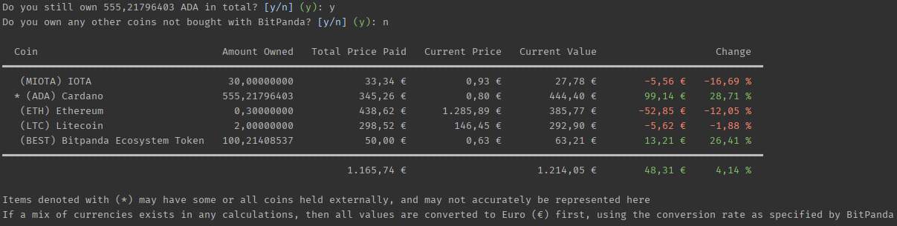

# CryptoGains

A very simple Cross-platform Command Line BitPanda portfolio viewer. The main use case is to see the total gain of any cryptocurrencies you have bought using the BitPanda Brokerage service, by comparing the price paid, with the current value of the coins.
This view is currently not available within BitPanda itself, and therefore I decided to write this small utility. You will need to create an API Key within BitPanda, with the `transactions` scope defined, and then set it as an Environment Variable with key `BITPANDA`.

CryptoGains will try to get all transactions from BitPanda, and then aggregate any purchases made by Coin. For example, if I bought 50 Cardano ADA coins for 0,50 € each, and then at a later date bought 100 Cardano ADA for 0,60 € each, 
it will show as 150 ADA bought for 85,00 €. It will then calculate the current price for all 150 ADA, and also show the difference as a number, but also as a percentage.

Additionally, if you have withdrawn any coins out from the BitPanda wallets, it will ask you if you still own that many elsewhere. You can then opt to change the amount, and the total current value column will be calculated based on how many you say you have.

After that, it will also ask if you own any other cryptocurrencies not bought with BitPanda, so these can be shown as well. You can only choose from coins supported by BitPanda as the prices for each coin are calculated based on BitPanda data.

Example screenshot:

---

# Installation and Usage

* Tested on Linux and Windows.
* Should work on Mac, but have not personally tested it

* Download the binary for your system from the [releases section](https://github.com/kaeedo/CryptoGains/releases/latest)
* Put it in any directory
* Open your favorite terminal or command line program
* Navigate to where the file is located.
* Run it. It will prompt you for first time usage

---

### Building from source

It is implemented using F# on .Net 5. Development is also completely cross-platform. Requires the .Net 5 SDK [from here](https://dotnet.microsoft.com/download/dotnet/5.0)
* Clone the repository
* Run `dotnet build`

---

### Potential error:

If you see an error that looks similar to the following: 

    Expecting an object with a field named `data` but instead got:
        {
            "errors": [
            {
                "status": 401,
                "code": "unauthorized",
                "title": "Credentials/Access token wrong"
            }]
        }"

Then your BitPanda API Key is likely wrong or missing

---

### Donations

Donations are greatly appreciated, but not needed at all. Please only donate if you are in a position to be able to afford it, and only if you truly believe in the gift of giving.

Liberapay: 

Ethereum: `0x05f231D19c19A2111fe03c923F26813Bad43B57f`

Cardano ADA: `addr1qx35nmy62dfp3n5tqgga92gxcnq5vkvflw963yg7fm5e5my68x9frc2qq0r8nstjtnjcrcnpmtpzwvp0sqz46y4ykrmqrd4dg9`

Litecoin: `MSaBzQ81tVmbPhcqwh2hnvzsXDE4LYq63W`
